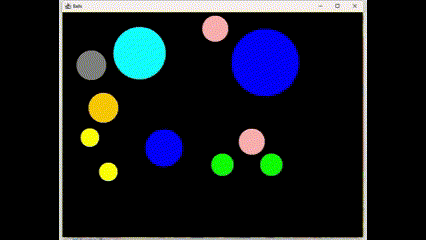
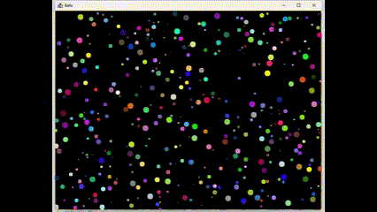
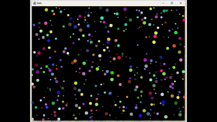

Simple Circle Body System Simulator
===================================

This is a simple simulator for a system of bodies with circular shape. It is written in Java and uses the Swing library
for the GUI.

Features
--------

* Collision detection and elastic collision response

  

* Forces

  

* Gravity

  

* Medium resistance

  

Building
--------

To build the project clone the repository and run the following command in the root directory:

```bash
$ ./gradlew build
```

Running
-------

To run the simulator execute the following command in the root directory:

```bash
$ ./gradlew run
```

Controls
--------

- Use numbers `1`-`6` to select to switch extensions on and off.
- Use `s` to set a few bodies.
- Use `r` or `R` to set few bodies.
- Use `a` to add a random velocity to all bodies.
- Use `m` to toggle collision mesh visualization.
- Use `t` to toggle trails.
- Use `c' to clear trails and collision mesh.
